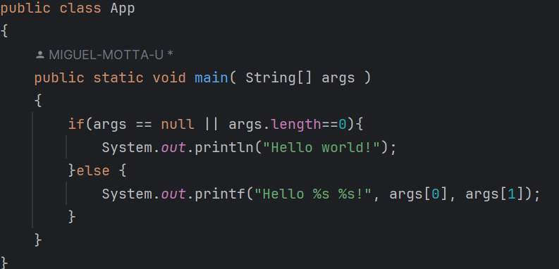

# Lab 2 - Maven
## Integrantes
### Diego Macía
### Miguel Motta

## Introducción
### ¿Cuál es su mayor utilidad?
Maven te permite usar bibliotecas externas en tu proyecto Java. Estas bibliotecas manejan funcionalidades complejas y comunes. Por ejemplo, si quieres usar la fecha y hora actuales en un proyecto Java, puedes usar las bibliotecas Joda Time. Maven también admite marcos externos para crear los proyectos.

### Fases de maven
* Validate
* Compile
* Test
* Package
* Integration Test
* Verify
* Install
* Deploy

### Ciclo de vida de la construcción

#### Validate
Esta fase se encarga de hacer la verificación de dependencias, para comprobar que el proyecto cuenta con la información necesaria para ser procesada.

#### Compile
En esta fase se compilan todos los ficheros .java y genera los archivos .class del proyecto.

#### Test
En esta fase se compilan todos los ficheros .java de las pruebas unitarias del proyecto, esto se hace con el fin de garantizar que el código es correcto, el grado de certeza depende de las pruebas unitarias.

#### Package
En esta fase se generan todos los archivos empaquetados de nuestro código, son necesarios para poder compilar y desplegar el proyecto desde un servidor.

#### Integration Test
Esta fase comprueba que los diferentes componentes de la aplicación funcionen correctamente, además, de garantizar que se integre correctamente con sistemas externos, bases de datos, servicios web, etc.

#### Verify
En esta fase de despliega el artefacto en el repositorio LOCAL.

#### Install
En esta fase se hace la implementación de las dependencias que pueda tener el proyecto, para garantizar que sea independiente y sea procesado completamente.

#### Deploy
Finalmente, cuando el arquetipo está en su estado final listo para ser implementado, se despliega en un entorno específico. Generalmente se despliega en un servidor remoto o un entorno no local.


### Para qué sirven los plugins
Los plugins en Maven, son componenetes que podemos implementar, extender y personalizar en el proceso de construcción, sus funciones más importantes son:

Extender y personalizar el proceso de construcción: Permiten agregar funcionalidades específicas a las fases del ciclo de vida de Maven.
Ejecutar tareas: Cada plugin puede contener uno o más "goals" (objetivos) que realizan tareas específicas.
Automatizar procesos: Ayudan a automatizar tareas comunes de desarrollo como compilación, pruebas, empaquetado, generación de informes, etc.
Proporcionar flexibilidad: Permiten adaptar Maven a las necesidades específicas de cada proyecto.

Ejemplos:
* `maven-compiler-plugin`: Para compilar el código fuente
* `maven-surefire-plugin`: Para ejecutar pruebas unitarias
* `maven-jar-plugin`: Para crear archivos JAR
* `maven-deploy-plugin`: Para desplegar artefactos en un repositorio remoto

### ¿Qué es y para qué sirve el repositorio central de maven?
El repositorio central de Maven es esencial para el funcionamiento del ecosistema Maven, ya que proporciona un punto de referencia común para la mayoría de los proyectos Java.

* Almacenamiento centralizado: Proporciona un lugar único donde se pueden encontrar la mayoría de las bibliotecas Java de código abierto.
* Gestión de dependencias: Facilita la gestión de dependencias en proyectos Java, permitiendo a Maven descargar automáticamente las bibliotecas necesarias.
* Versiones: Almacena múltiples versiones de cada biblioteca, permitiendo a los desarrolladores especificar exactamente qué versión necesitan.
* Metadatos: Contiene información sobre cada artefacto, incluyendo su grupo, ID de artefacto, versión, etc.
* Acceso global: Permite a los desarrolladores de todo el mundo acceder a las mismas bibliotecas, fomentando la estandarización.

# EJERCICIO DE LAS FIGURAS
## Creación del proyecto


# Compilar y ejecutar

Busque cuál es el objetivo del parámetro "package" y qué otros parámetros se podrían enviar al comando mvn. Compila el código,
ejecuta las pruebas y empaqueta el código.

El parametro package tiene como objetivo ejecutar el ciclo de vida de maven hasta la fase de empaquetado.
Parametros que se podrian usar con mvn package:
-DskipTests : omite la ejecución de las pruebas.
-Dmaven.test.skip=true : omite la compilación y ejecución de las pruebas.
-Darguments : permite pasar argumentos adicionales a los plugins que se ejecutan durante el empaquetado.
-p : activa un perfil específico del proyecto.


Busque cómo ejecutar desde línea de comandos, un proyecto maven y verifique la salida cuando se ejecuta con la clase App.java como parámetro en "mainClass".
Para ejecutar un proyecto de maven desde la linea de comandos se necesita:
-Configurar el exec-maven-plugin en el pom.xml


-Compilar el proyecto y usar el comando mvn exec:java para ejecutarlo


-Buscar cómo enviar parámetros al plugin "exec".
Para enviar parametros a exec se usa el comando -Dexec.args="param1 param2 param3"


-Con nombre y apellido


-Arreglandolo para que aparezca nombre y apellido



Ejecute múltiples veces la clase ShapeMain, usando el plugin exec de maven con los siguientes parámetros y verifique la salida en consola para cada una:

-   Sin parámetros
-   Parámetro: qwerty
-   Parámetro: pentagon
-   Parámetro: Hexagon

#### Sin Parámetros:


Se ejecuta correctamente, y la clase prevee este evento con el siguiente condicional:

```
if  (args == null || args.length != 1) {  
	System.err.println("Parameter of type RegularShapeType is required.");  
    return;}
```
#### qwerty:


La clase 'querty' no está definida como `RegularShapeType` por lo que no es admitida y envía el siguiente error:
> `Parameter 'qwerty' is not a valid RegularShapeType`

#### pengaton:


La clase está instanciada con el primer caracter en mayúscula, por lo que al pasar el parámetro de "pentagon" en lugar de "Pentagon" no lo reconoce cómo una clase, por lo que se imprime el siguiente mensaje:
> `Parameter 'pentagon' is not a valid RegularShapeType`

#### Hexagon:


La clase `Hexagon` si está definida, por lo que que se se crea un objeto de clase `Hexagon` e imprime su número de lados con el retorno del método implementado en la interfaz.